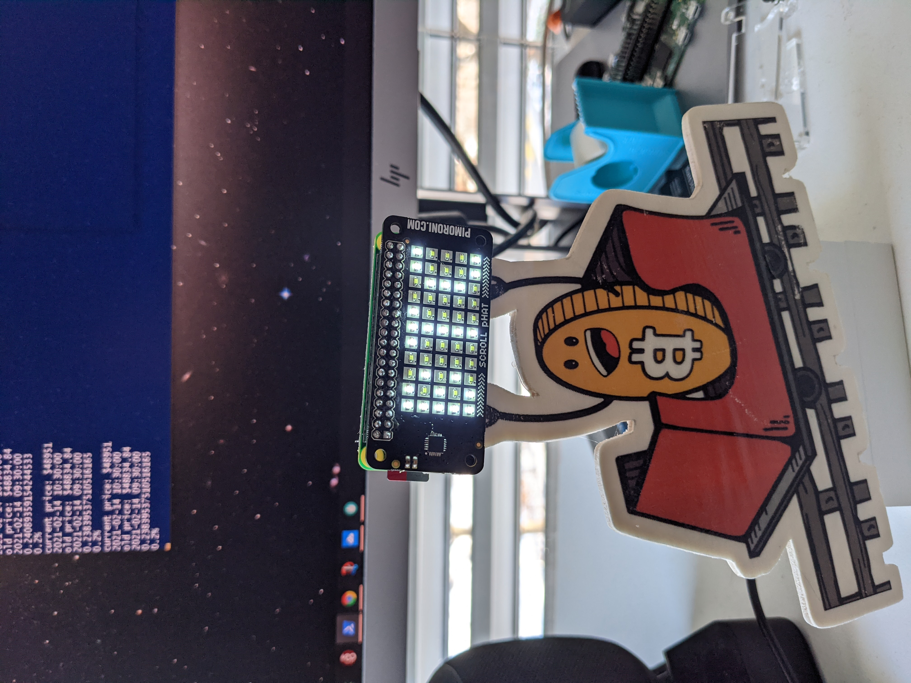

# the real hodler coaster

## howto

### pre condition
get an api key from cryptocompare: https://min-api.cryptocompare.com/ and save it in a file, ie in my case secrets.py with the name of API_KEY_CRYPTOCOMPARE

get yourself a raspberry pi zero and a servo motor. to display I used an pimoroni scrollphat (https://github.com/pimoroni/scroll-phat), that I had lying around.

the code, stored in getcrypto.py, polls the cryptocompare api for your favorite crypto and displays the current value in USD plus the change in the last hour.

accoring to the change, the hodlercoaster turns left or right, angle accoring to change. the bigger the change the bigger the angle.

### note 
the free api key of cryptocompare allows for 100'000 calls per month. at around 40'000 mins/per month you should not poll the api too frequent. by polling it every 5 mins you should be safe.